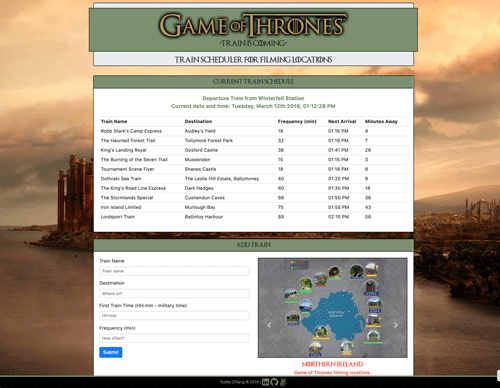

# Get a Hike

Looking for a hiking trail in your area? This app will allow you to search for nearby trails with detailed information and maps about local trails.

## App Interface
Instructions:
* Enter key terms in the field and click search.
* Pick one of the hits to see additional details such as difficulty, distance, weather, map.
* Click on the map for dynamic interaction.

Click on the link!
https://echiang73.github.io/SEMI_Project_One/

## Built with
* HTML5
* CSS3
* JavaScript with various dynamically created elements
* Bootstrap
* jQuery
* API (from MapBox, Hiking Project, Here.com, and Open Weather)
* Firebase
* Moment.js
* Responsive Web Design Media Query
* Font Awesome and @font-face

### Here are the previews of the web application:

