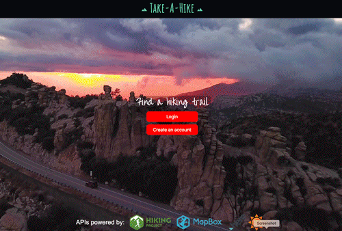

# Take a Hike

Looking for a hiking trail in your area? This app will allow you to search for nearby trails with detailed information and maps about local trails.  This is our first group project: Front-end development by Serena Stephens and Isamar Valdivia. Back-end development by Eddie Chiang and Michael Garcia.

## App Interface
Instructions:
* Enter key terms in the field and click search.
* Pick one of the hits to see additional details such as difficulty, distance, weather, map.
* Click on the map for dynamic interaction.
* Take a virtual tour of any hiking trail using Earth.
* Get driving directions to the start site of the trail.

Click on the link!
https://echiang73.github.io/SEMI_Project_One/

## Built with
* HTML5
* CSS3
* JavaScript with various dynamically created elements
* Bootstrap
* jQuery
* APIs (from MapBox, Hiking Project, Here.com, and Open Weather Map)
* CSS-Materialize
* Firebase
* Responsive Web Design Media Query
* Google Fonts

### Here is a preview of the web application:

